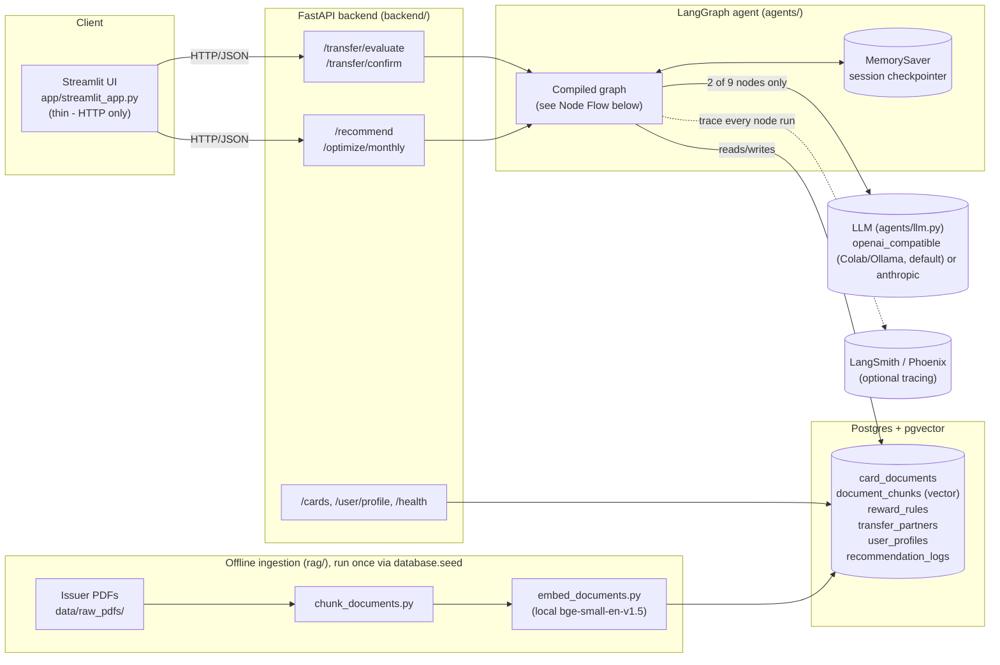
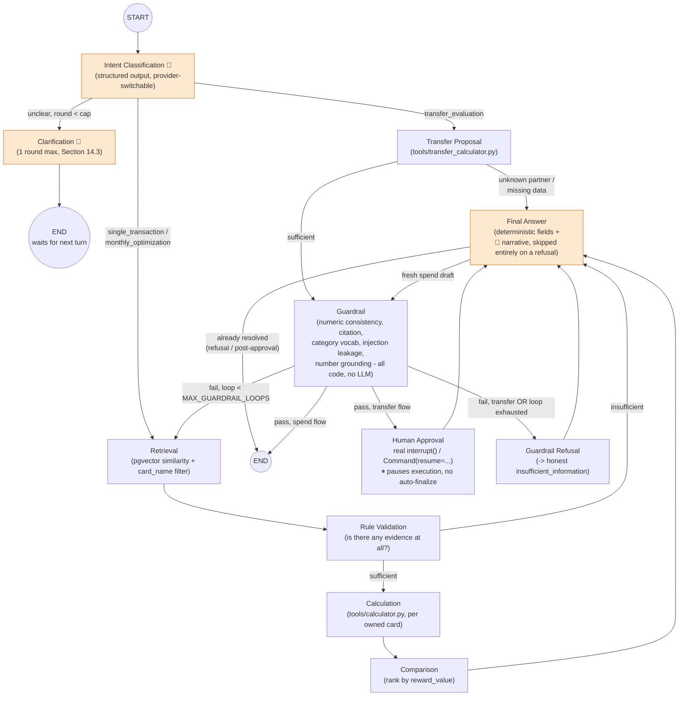
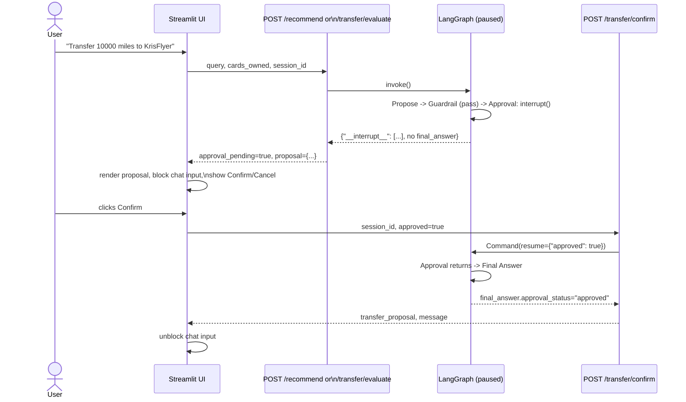
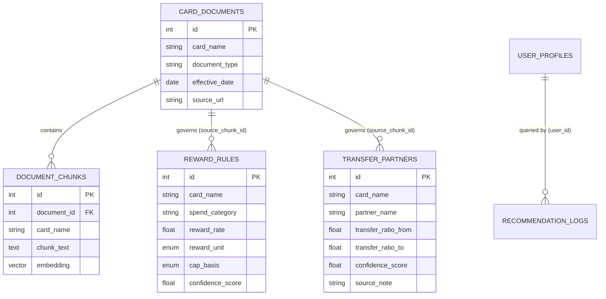
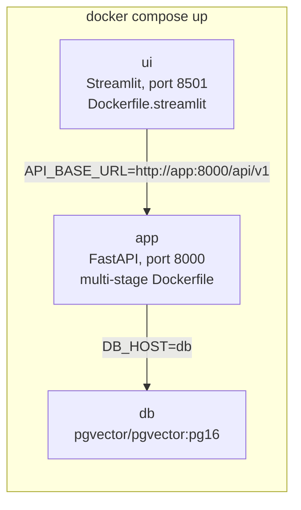

# Architecture

**Phase 4 deliverable** (Implementation Guide Section 3: "architecture diagrams"). Companion
to `README.md` (how to run it) and `EVALUATION_REPORT.md` (how well it works) - this document
answers what the system is built from and how a request actually flows through it.

## Governing principle

Every diagram below is a direct consequence of one constraint (guide Section 1.2): **facts,
arithmetic, and judgment must never leak into each other.**

| Concern | Owned by | Never done by |
|---|---|---|
| Facts (what a card's T&C says) | Retrieval (RAG, `tools/retriever.py`) | The LLM's memory |
| Arithmetic (what the reward is worth) | `tools/calculator.py`, `tools/transfer_calculator.py` | The LLM |
| Judgment (what to tell the user, and whether to trust the draft) | LLM (2 of 9 graph nodes) + Guardrail node | An unchecked LLM output |

## System components

Dependency direction (guide Section 22.1, enforced by code review, not tooling):
`backend/` → `agents/` → `services/` → `tools/`, `database/`. `tools/` never imports
`agents/` - it stays framework-agnostic and independently testable, which is what makes the
84 `tools/`+`database/models.py`+`agents/state.py` lines in the coverage report hit 100%
without a single mock.

## LangGraph node flow

Nine nodes total; only **Intent Classification** and **Final Answer**'s narrative step touch
an LLM (shaded). Every other node - including the two added in Phase 3, Guardrail and Human
Approval - is deterministic, pure Python, independently unit-tested without any LLM call.

Two loop-prevention caps, both hard iteration counters in `agents/state.py`, never an
assumption that "the LLM won't loop forever" (Section 14.3 / Section 24's explicit pitfall):

- `MAX_CLARIFICATION_ROUNDS = 1` - a second unclear intent is forced through to a best-effort
  or honest refusal, never a second question.
- `MAX_GUARDRAIL_LOOPS = 2` - a persistently-failing draft retries retrieval up to twice, then
  is refused. `tests/agent/test_graph.py::TestGuardrailLoop` drives this end-to-end with a
  mocked LLM that fails identically every retry, proving the cap actually terminates the graph
  rather than looping.

## The Human Approval gate (Phase 3's core safety property)

The graph cannot reach `final_answer` with a non-null `approval_status` without a
`Command(resume=...)` call landing on the exact paused `thread_id` - there is no code path
that finalizes a transfer from a single `invoke()`. `agents/runner.py`'s
`get_pending_interrupt()` / `resume_agent()` / `has_pending_approval()` are the only points
that touch this mechanism.

## Data model (selected tables)

`reward_rules.confidence_score` (0.85-1.0, issuer-PDF-sourced) vs.
`transfer_partners.confidence_score` (0.7-0.85, secondary-source cross-checked) is a
deliberate, visible distinction - see `README.md`'s "Data sourcing" section.

## Deployment

`docker-compose.yml` is the primary local-dev and capstone-demo deployment mechanism (guide
Section 20.1) - a full orchestration platform is explicitly out of scope at this project's
scale. See `README.md`'s "Rollback" section for the commit-SHA image tagging strategy
(Section 20.5) and a demonstrated rollback cycle.
